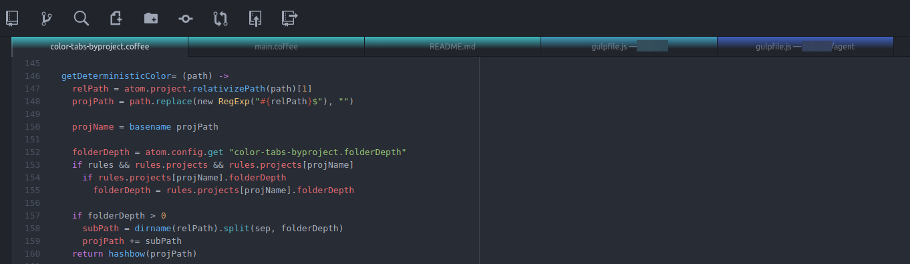

# color-tabs-byproject package

Adds colors to tabs by project folder name (and optionally subfolders).



Fork of original project [paulpflug/color-tabs](https://github.com/paulpflug/color-tabs)
with [pull request](https://github.com/paulpflug/color-tabs/pull/25)
applied and modified to color tabs by project root folder and optionally
by subfolder levels within the project tree.

## Edit per project rules
Use menu `Packages -> Color Tabs by Project -> Edit Rules` to open the rules editor:
```cson
projects:
  "/your-project-path/":
    folderDepth: 1
    color: "#980909"
```
The hashed color is saved in the above project entry and can be overridden by
Editting the above (e.g. using package color-picker).

## Developing

Run `npm install` in the package directory.

Open it in atom in dev mode or run `apm link`.

For debugging set the debug field in package settings to the needed debug level.

Should autoreload the package on changes in `lib` and `styles` folders.

```
localStorage.debug = 'color-tabs-byproject'
```

### Release to Atom
```bash
# for a patch release
apm publish patch

# for a minor release
apm publish minor

# for a major release
apm publish major
```
